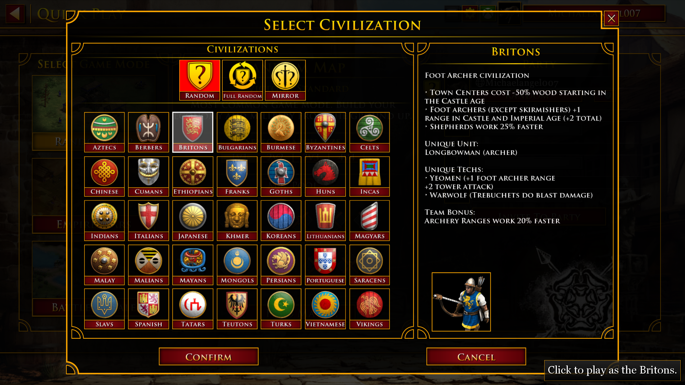
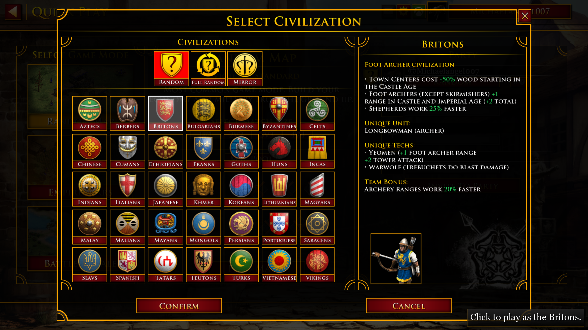
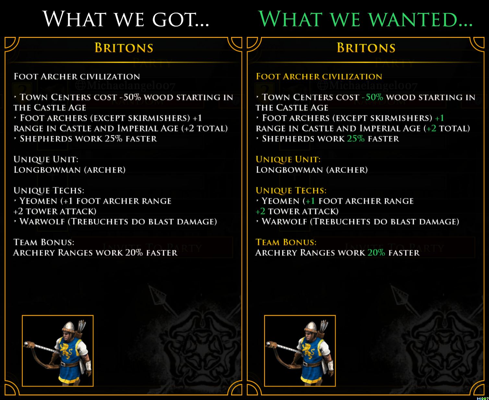

Game: [Age of Empires II: Definitive Edition](https://store.steampowered.com/app/813780/Age_of_Empires_II_Definitive_Edition/)

# WHAT is bad:

* 

# WHY it is bad:

* The civilization description is a wall of text with no font header size changes and a single color effectively makes the entire thing "noise".

# HOW to make it good:

Good UI has a good S:N:~N (Signal:Noise:Anti-Noise) ratio.

* Increase header sizes, and/or
* Add a _splash_ of color to highlight the numeric values gamers _actually_ care about

Color is like seasoning.

* Too _little_ and everything is bland (like the original)
* Too _much_ and it over-powers everything else.

For example, even highlighting the numeric values while leaving the headers size alone is an improvement:

* 

With color alone we don't even need to tweak the header sizes:

* 

# TL:DR;

Here is a summary comparing _What we got_ vs _What we wanted_:

* 

# History

Changed order so that the comparison picture now shows:

* Actual
* Expected

Last updated: Version 2, Nov 18, 2020.
